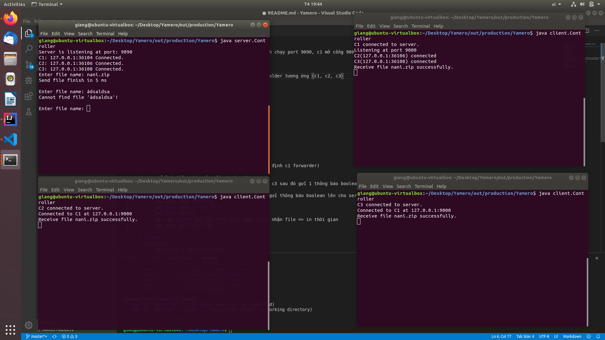

# How to run
Hiện tại mới test chạy trên 1 máy, server mặc định chạy port 9090, c1 mở cổng 9000 để c2 c3 kết nối đến
- Import vào intellij
- Build với intellij
- các file cần gửi nằm trong folder Yamero
- các file gửi đến từng client sẽ nằm trong các folder tương ứng (c1, c2, c3)
- Mở 4 terminal vào thư mục ./out/production/Yamero rồi chạy như hình


# Server
- UIManager: hiển thị ở console
- ClientConnection: chứa
	- socket: Socket đến client đó
	- id: 1 2 3
	- port: port đến client đó
	- ip: ip đến client
	- dataInputStream
	- dataOutputStream
	- send(byte[]) gửi thông tin cho client
- Controller: chứa
	- main tạo 3 ClientConnection c1, c2, c3 (mặc định c1 forwarder)
	- đợi kết nối
	- gửi lại thông tin các client cho c1
	- c1 mở socket ở cổng 9000 đợi kết nối từ c2, c3 sau đó gửi 1 thông báo boolean lên cho server (đã sẵn sàng hay chưa)
	- gửi thông tin các client cho c2,c3
	- c2, c3 kết nối đến c1 qua cổng 9000 sau đó gửi thông báo boolean lên cho server biểu thị kết nối thành công
	- cho phép nhập tên file
	- gửi file name + file size
	- gửi file cho c1
	- đợi các client gửi lại thời gian hoàn thành nhận file => in thời gian
	- cho phép gửi file tiếp

# Client
- Controller:
	- Server ip + port hard code 
	- kết nối đến Server
	- đợi xác nhận iden của mình ( mình là c1, c2 hay c3)
	- c1 nhận file name, gửi cho c2, c3
	- c1 nhận file size, gửi cho c2, c3
	- c1 nhận file, gửi cho c2, c3
	
# Configuration
Sử dụng giá trị default khi không tìm thấy file config theo đường dẫn hoặc trong file config không có giá trị tương ứng.
- Client - ```out/production/Yamero/client/config.properties```:
    - ```server-ip```: địa chỉ ip của server (default: ```127.0.0.1```)
- Helper - ```out/production/Yamero/helpers/config.properties```:
    - ```file-buffer-size```: buffer đọc ghi và gửi nhận file (default: ```1024```) 